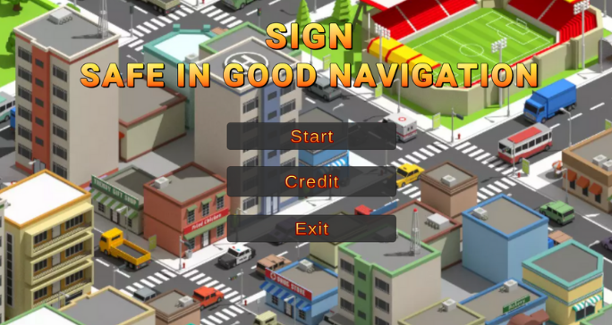
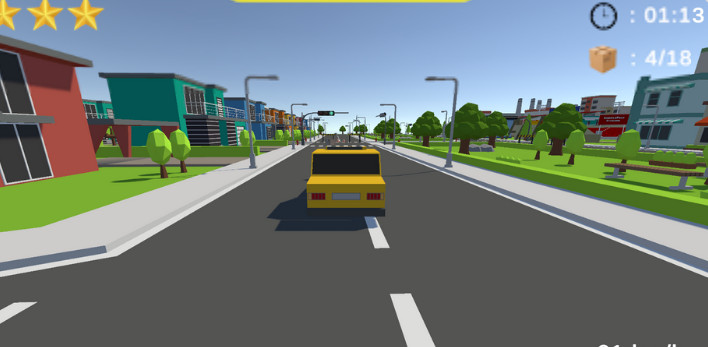

# 🎮 SIGN Game Project

> Game berbasis Unity dengan fitur multiplayer, AI Navigation, dan tampilan resolusi tinggi (4K).

---

## 📸 Screenshots

### 🔐 Halaman Login


### 🕹️ Saat Bermain


---

## 📋 Deskripsi

**SIGN** adalah sebuah game yang dikembangkan menggunakan Unity 6 (versi 6000.2.2f1) dengan dukungan **Universal Render Pipeline (URP)** untuk tampilan grafis yang optimal. Game ini mendukung fitur multiplayer dan menggunakan sistem navigasi AI untuk karakter non-pemain (NPC).

---

## ⚙️ Spesifikasi Teknis

| Komponen            | Detail                        |
|---------------------|-------------------------------|
| Engine              | Unity 6000.2.2f1              |
| Render Pipeline     | Universal Render Pipeline (URP) 17.2.0 |
| Resolusi Default    | 3840 × 2160 (4K)              |
| Input System        | Unity New Input System 1.16.0 |
| Multiplayer         | Unity Multiplayer Center 1.0.0 |
| AI Navigation       | Unity AI Navigation 2.0.9     |
| Visual Scripting    | Unity Visual Scripting 1.9.8  |
| Timeline            | Unity Timeline 1.8.9          |
| Platform Target     | PC & Android                  |

---

## 📦 Package yang Digunakan

```
com.unity.ai.navigation         v2.0.9
com.unity.inputsystem           v1.16.0
com.unity.multiplayer.center    v1.0.0
com.unity.render-pipelines.universal  v17.2.0
com.unity.timeline              v1.8.9
com.unity.ugui                  v2.0.0
com.unity.visualscripting       v1.9.8
com.unity.test-framework        v1.6.0
```

---

## 🚀 Cara Membuka Project

### Prasyarat
- **Unity Hub** sudah terinstall
- **Unity Editor versi 6000.2.2f1** (Unity 6)
- Git atau Plastic SCM (version control yang digunakan proyek ini)

### Langkah-langkah

1. **Clone / Download** repository ini
   ```bash
   git clone https://github.com/thoriqmu/sign
   ```

2. **Buka Unity Hub**, klik tombol **Open** ke pilih folder project ini

3. Pastikan Unity otomatis mendeteksi versi editor yang sesuai (`6000.2.2f1`)

4. Tunggu proses **import asset** selesai (bisa memakan waktu beberapa menit pertama kali)

5. Buka scene utama dari folder `Assets/Scenes/` dan tekan **Play** ▶️

---

## 🗂️ Struktur Project

```
SIGN/
├── Assets/               # Semua asset game (scene, script, prefab, dll)
├── Packages/             # Daftar package Unity yang digunakan
│   ├── manifest.json
│   └── packages-lock.json
├── ProjectSettings/      # Pengaturan project Unity
├── UserSettings/         # Pengaturan lokal editor
└── README.md
```

---

## 🛠️ Fitur Utama

- ✅ **Sistem Login** Halaman autentikasi pemain sebelum masuk ke game
- ✅ **Multiplayer** Mendukung mode bermain bersama menggunakan Unity Multiplayer
- ✅ **AI Navigation** NPC dengan navigasi cerdas menggunakan NavMesh
- ✅ **URP Graphics** Tampilan visual modern dengan Universal Render Pipeline
- ✅ **Input System Baru** Menggunakan Unity Input System terbaru untuk kontrol yang responsif
- ✅ **Resolusi 4K** Didesain untuk layar resolusi tinggi (3840×2160)

---

## 👤 Developer

**Kelompok 7 SIGN**
Program Studi S1 Teknik Informatika Mata Kuliah Game Programming

| No | Nama | NIM |
|----|------|-----|
| 1 | Muhammad Zaky Novananda | 220535608803 |
| 2 | Ryan Dwi Wicaksono | 220535603107 |
| 3 | Thoriq Muchlisin | 220535603871 |
| 4 | Wesly M Sihombing | 220535609970 |

---

## 📝 Catatan

- Project ini menggunakan **Plastic SCM** sebagai version control bawaan Unity
- Untuk build Android, pastikan Android Build Support sudah terinstall di Unity Hub
- Jika ada error saat pertama buka, coba klik **Assets ke Reimport All**

---

## 📄 Lisensi

Project ini bersifat **open source** dan bebas digunakan oleh siapa saja. Silakan gunakan, modifikasi, dan distribusikan sesuai kebutuhan.
